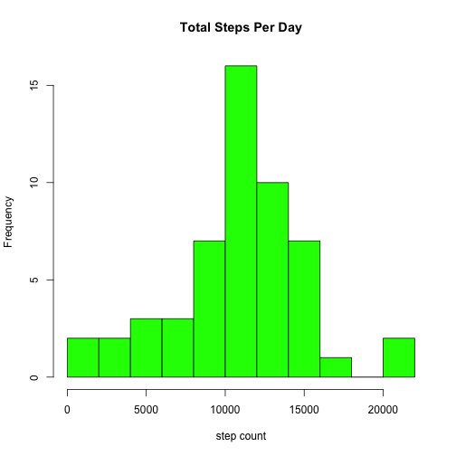
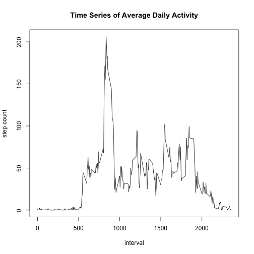
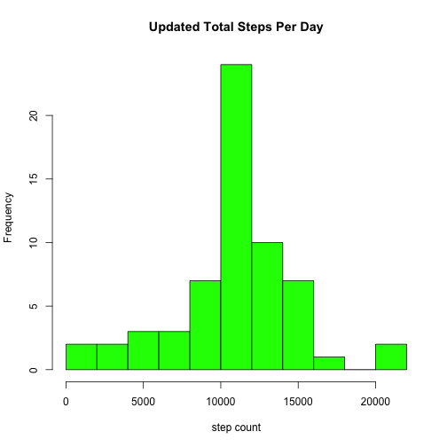
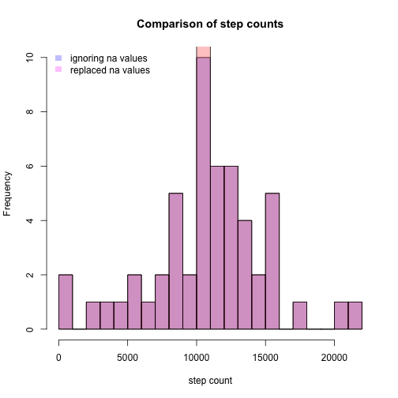
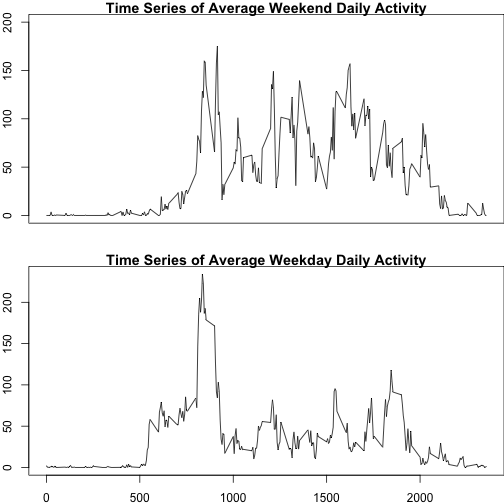

First, I am loading and processing the data for analysis. This involves reformatting the date column to be a date rather than a factor, and the counts to numbers rather than integers:

```r
setwd("~/r_coursera/RepData_PeerAssessment1")
activity<-read.csv("activity.csv")
activity$date<-as.Date(activity$date, format="%Y-%m-%d")
activity$steps<-as.numeric(activity$steps)
```

For the first section of the assighment, I am melting the data to allow for aggregation by date and reporting of the mean and median values.


```r
options(digits=2, scipen=5)
library(reshape2)
day<-melt(activity, c("interval","date"))
avday<-dcast(day, date ~., sum)
avday$count<-avday[,2]
mnday<-round(mean(avday$count, na.rm=TRUE), 2)
mdday<-median(avday$count, na.rm=TRUE)
```

The resulting histogram can be found below. Note that the mean value for step counts is ~10766.19 and the median value is 10765


```r
hist(avday$count, breaks=12, col="green", main="Total Steps Per Day", xlab = "step count")
```

 

## Average daily time series data
For this analysis, I am melting the original dataset to allow aggregation by time bin


```r
tim<-melt(activity, id=c("interval","date"))
avtim<-dcast(tim, interval ~., mean, na.rm=TRUE)
avtim$ct<-avtim[,2]
plot(avtim$interval, avtim$ct, type="l", main="Time Series of Average Daily Activity", xlab="interval", ylab="step count")
```

 

```r
bin<-which.max(avtim$ct)
avtim$interval1<-sprintf("%04d",avtim$interval)
maxtim<-avtim[bin,4]
```

The time bin with the greatest activity on average occurring at 0835 hours.

##Imputing missing values

Here I am replacing missing values with the average for that time bin, and calling the new data frame newact1.


```r
actavg<-merge(activity, avtim, by.x="interval", by.y="interval")
actavg[is.na(actavg$steps),]$steps<-actavg[is.na(actavg$steps),]$ct
newact<-activity
newact$steps<-actavg$steps
newact$date<-actavg$date
newact$interval<-actavg$interval
newact1<-newact[order(newact$date),]
head(actavg, 100)
```

```
##     interval steps       date    .   ct interval1
## 1          0  1.72 2012-10-01 1.72 1.72      0000
## 2          0  0.00 2012-11-23 1.72 1.72      0000
## 3          0  0.00 2012-10-28 1.72 1.72      0000
## 4          0  0.00 2012-11-06 1.72 1.72      0000
## 5          0  0.00 2012-11-24 1.72 1.72      0000
## 6          0  0.00 2012-11-15 1.72 1.72      0000
## 7          0  0.00 2012-10-20 1.72 1.72      0000
## 8          0  0.00 2012-11-16 1.72 1.72      0000
## 9          0  0.00 2012-11-07 1.72 1.72      0000
## 10         0  0.00 2012-11-25 1.72 1.72      0000
## 11         0  1.72 2012-11-04 1.72 1.72      0000
## 12         0  0.00 2012-11-08 1.72 1.72      0000
## 13         0  0.00 2012-10-12 1.72 1.72      0000
## 14         0  0.00 2012-10-30 1.72 1.72      0000
## 15         0  0.00 2012-11-26 1.72 1.72      0000
## 16         0 47.00 2012-10-04 1.72 1.72      0000
## 17         0  0.00 2012-11-27 1.72 1.72      0000
## 18         0  0.00 2012-10-31 1.72 1.72      0000
## 19         0  0.00 2012-11-18 1.72 1.72      0000
## 20         0  0.00 2012-10-05 1.72 1.72      0000
## 21         0  0.00 2012-10-14 1.72 1.72      0000
## 22         0  0.00 2012-10-23 1.72 1.72      0000
## 23         0  0.00 2012-11-19 1.72 1.72      0000
## 24         0  0.00 2012-10-11 1.72 1.72      0000
## 25         0  0.00 2012-10-15 1.72 1.72      0000
## 26         0  0.00 2012-10-06 1.72 1.72      0000
## 27         0  0.00 2012-11-11 1.72 1.72      0000
## 28         0  0.00 2012-11-29 1.72 1.72      0000
## 29         0  0.00 2012-11-02 1.72 1.72      0000
## 30         0  0.00 2012-10-07 1.72 1.72      0000
## 31         0  0.00 2012-11-03 1.72 1.72      0000
## 32         0  1.72 2012-11-30 1.72 1.72      0000
## 33         0  0.00 2012-11-21 1.72 1.72      0000
## 34         0  0.00 2012-10-02 1.72 1.72      0000
## 35         0  0.00 2012-10-26 1.72 1.72      0000
## 36         0  0.00 2012-11-22 1.72 1.72      0000
## 37         0  0.00 2012-11-28 1.72 1.72      0000
## 38         0  0.00 2012-11-13 1.72 1.72      0000
## 39         0  0.00 2012-10-18 1.72 1.72      0000
## 40         0  0.00 2012-10-27 1.72 1.72      0000
## 41         0  1.72 2012-11-14 1.72 1.72      0000
## 42         0 10.00 2012-10-22 1.72 1.72      0000
## 43         0 34.00 2012-10-10 1.72 1.72      0000
## 44         0  0.00 2012-10-19 1.72 1.72      0000
## 45         0  1.72 2012-11-09 1.72 1.72      0000
## 46         0  0.00 2012-10-17 1.72 1.72      0000
## 47         0  0.00 2012-10-16 1.72 1.72      0000
## 48         0  0.00 2012-10-29 1.72 1.72      0000
## 49         0  1.72 2012-11-01 1.72 1.72      0000
## 50         0  0.00 2012-10-21 1.72 1.72      0000
## 51         0  1.72 2012-11-10 1.72 1.72      0000
## 52         0  0.00 2012-10-03 1.72 1.72      0000
## 53         0  0.00 2012-11-17 1.72 1.72      0000
## 54         0  0.00 2012-11-12 1.72 1.72      0000
## 55         0  0.00 2012-10-25 1.72 1.72      0000
## 56         0  0.00 2012-10-13 1.72 1.72      0000
## 57         0  0.00 2012-10-24 1.72 1.72      0000
## 58         0  1.72 2012-10-08 1.72 1.72      0000
## 59         0  0.00 2012-11-20 1.72 1.72      0000
## 60         0  0.00 2012-11-05 1.72 1.72      0000
## 61         0  0.00 2012-10-09 1.72 1.72      0000
## 62         5  0.00 2012-10-13 0.34 0.34      0005
## 63         5  0.34 2012-10-01 0.34 0.34      0005
## 64         5  0.00 2012-11-18 0.34 0.34      0005
## 65         5  0.00 2012-10-05 0.34 0.34      0005
## 66         5  0.00 2012-11-29 0.34 0.34      0005
## 67         5  0.00 2012-11-25 0.34 0.34      0005
## 68         5  0.34 2012-11-04 0.34 0.34      0005
## 69         5  0.00 2012-11-02 0.34 0.34      0005
## 70         5  0.00 2012-11-23 0.34 0.34      0005
## 71         5  0.00 2012-11-06 0.34 0.34      0005
## 72         5  0.00 2012-10-21 0.34 0.34      0005
## 73         5  0.00 2012-11-21 0.34 0.34      0005
## 74         5  0.00 2012-11-15 0.34 0.34      0005
## 75         5  0.00 2012-11-16 0.34 0.34      0005
## 76         5  0.34 2012-11-30 0.34 0.34      0005
## 77         5  0.00 2012-10-11 0.34 0.34      0005
## 78         5  0.00 2012-11-13 0.34 0.34      0005
## 79         5  0.00 2012-10-15 0.34 0.34      0005
## 80         5  0.00 2012-11-19 0.34 0.34      0005
## 81         5  0.00 2012-11-11 0.34 0.34      0005
## 82         5  0.34 2012-11-14 0.34 0.34      0005
## 83         5  0.00 2012-11-26 0.34 0.34      0005
## 84         5  0.00 2012-10-28 0.34 0.34      0005
## 85         5  0.00 2012-11-24 0.34 0.34      0005
## 86         5  0.34 2012-11-09 0.34 0.34      0005
## 87         5  0.00 2012-10-22 0.34 0.34      0005
## 88         5  0.00 2012-10-16 0.34 0.34      0005
## 89         5  0.34 2012-10-08 0.34 0.34      0005
## 90         5  0.00 2012-11-28 0.34 0.34      0005
## 91         5  0.34 2012-11-10 0.34 0.34      0005
## 92         5  0.00 2012-10-23 0.34 0.34      0005
## 93         5  0.00 2012-10-03 0.34 0.34      0005
## 94         5  0.00 2012-10-27 0.34 0.34      0005
## 95         5  0.00 2012-11-20 0.34 0.34      0005
## 96         5  0.00 2012-10-06 0.34 0.34      0005
## 97         5  0.00 2012-10-30 0.34 0.34      0005
## 98         5  0.00 2012-10-31 0.34 0.34      0005
## 99         5 18.00 2012-10-10 0.34 0.34      0005
## 100        5  0.00 2012-11-03 0.34 0.34      0005
```

Now I am repeating the analyses from part one with the dataset containing the imputed values


```r
daynew<-melt(newact1, c("interval","date"))
avdaynew<-dcast(daynew, date ~., sum)
avdaynew$count<-avdaynew[,2]
mndaynew<-round(mean(avdaynew$count, na.rm=TRUE), 2)
mddaynew<-median(avdaynew$count, na.rm=TRUE)
```

The new histogram can be found below. Note that the mean value for step counts is ~10766.19 and the median value is 10766.19


```r
hist(avdaynew$count, breaks=12, col="green", main="Updated Total Steps Per Day", xlab = "step count")
```

 

Here is an overlay of the two histograms:


```r
ign<-hist(avday$count, breaks=24, plot=FALSE)
rep<-hist(avdaynew$count, breaks=24, plot=FALSE)
plot(ign, col=rgb(0,0,1,1/4), main="Comparison of step counts", xlab = "step count")
plot(rep, col=rgb(1,0,0,1/4), add=TRUE)
legend('topleft',c('ignoring na values','replaced na values'),
       fill = c(rgb(0,0,1,1/4), rgb(1,0,1,1/4)), bty = 'n',
       border = NA)
```

 

To address the question asked in the assignment, yes, adding in the missing values makes some difference, but because the missing values represent entire days and I replaced the missing values with the average for that time bin, it just increases the number of days with the average number of steps. It's questionable whether this is a reasonable data manipulation given the circumstances.

##Weekdays vs. Weekends
To examine whether the weekdays differ in profile from the weekends, I'm adding a weekday column to the original data and will filter by that to create two datasets: one with the weekday time series, and one with the weekend time series.


```r
 activity$day<- ifelse(weekdays(activity$date) %in% c("Saturday", "Sunday") ,"weekend", "weekday")
 weekends<-activity[activity$day=="weekend",]
 we<-melt(weekends, id=c("interval","date", "day"))
  avwe<-dcast(we, interval ~., mean, na.rm=TRUE)
  avwe$ct<-avwe[,2]
  bin<-which.max(avwe$ct)
  avwe$interval1<-sprintf("%04d",avtim$interval)
  maxwe<-avwe[bin,4]
  weekday<-activity[activity$day=="weekday",]
  wd<-melt(weekday, id=c("interval","date", "day"))
  avwd<-dcast(wd, interval ~., mean, na.rm=TRUE)
  avwd$ct<-avwd[,2]
  bin<-which.max(avwd$ct)
  avwd$interval1<-sprintf("%04d",avwd$interval)
  maxwd<-avwd[bin,4]
```

And the creation of the two-panel figure:


```r
par(mfrow=c(2,1), 
    mar = c(2, 2, 1, 0), oma=c(0,0,0,0))
plot(avwe$interval, avwe$ct, type="l", xaxt="n", ylim=c(0,200), main="Time Series of Average Weekend Daily Activity", xlab="", ylab="step count")
  plot(avwd$interval, avwd$ct, type="l", main="Time Series of Average Weekday Daily Activity", xlab="interval", ylab="step count")
```

 

